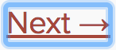

## 什么是可访问性

Web 可访问性（也被称为 [**a11y**](https://en.wiktionary.org/wiki/a11y)）指的是设计和创建可以被每个人使用的网站。可访问性支持是必要的，让辅助技术来解释网页。

React 完全支持创建可访问性网站，通常使用标准的 HTML 技术。

## 标准和指南

### WCAG

[网络内容可访问性指南](https://www.w3.org/WAI/intro/wcag)为创建可访问性站点提供了指导。

下面的 WCAG 列表提供了一个概览：

- [Wuhcag 的 WCAG 列表](https://www.wuhcag.com/wcag-checklist/)
- [WebAIM 的 WCAG 列表](http://webaim.org/standards/wcag/checklist)
- [A11Y 项目的列表](http://a11yproject.com/checklist.html)

### WAI-ARIA
[Web Accessibility Initiative - Accessible Rich Internet Applications](https://www.w3.org/WAI/intro/aria)文档包含了构建完全可访问的 JavaScript 部件的技术

需要注意的是，JSX 完全支持所有的 `aria-*` HTML 属性。尽管 React 中大多数的 DOM 属性都是小驼峰命名的，但是这些属性应该是小写的：

```javascript{3,4}
<input
  type="text" 
  aria-label={labelText}
  aria-required="true"
  onChange={onchangeHandler}
  value={inputValue}
  name="name"
/>
```

## 语义化 HTML
语义化 HTML 是 Web 应用程序可访问性的基础。使用各种 HTML 元素来加强网站信息的含义，通常会使得网站易于访问。

- [MDN 上的 HTML 元素参考](https://developer.mozilla.org/en-US/docs/Web/HTML/Element)

为了让 React 代码正常工作，我们有时会打破 HTML 语义化，在 JSX 中添加 `<div>` 元素，特别是在使用列表（`<ol>`、`<ul>` 和 `<dl>`）以及 HTML `<table>` 的时候。在这些情况下，我们应该使用 React Fragments 来将多个元素组合在一起。

当需要 `key` prop 时，使用 `<Fragment>`：

```javascript{1,8,11}
import React, { Fragment } from 'react';

function Glossary(props) {
  return (
    <dl>
      {props.items.map(item => (
        // 没有 `key` 会触发 React 的 key 警告
        <Fragment key={item.id}>
          <dt>{item.term}</dt>
          <dd>{item.description}</dd>
        </Fragment>
      ))}
    </dl>
  );
}
```

也可以在任何地方使用 `<></>`：

```javascript
function ListItem({ item }) {
  return ( 
    <>
      <dt>{item.term}</dt>
      <dd>{item.description}</dd>>
    </>
  );    
}
``` 

## 可访问表单

### 标签
每个 HTML 表单控件，例如 `<input>` 和 `<textarea>`，都需要打上可访问标签。我们需要提供描述性标签展示给屏幕阅读器。

下列资源向我们展示了如何去做：

- [W3C 如何标记元素的说明](https://www.w3.org/WAI/tutorials/forms/labels/)
- [WebAIM 如何标记元素的说明](http://webaim.org/techniques/forms/controls)
- [Paciello 小组阐述的可访问性名称](https://www.paciellogroup.com/blog/2017/04/what-is-an-accessible-name/)

虽然这些标准的 HTML 实践可以直接在 React 中使用，需要注意的是，在 JSX 中，`for` 属性被写作 `htmlFor`:

```javascript{1}
<label htmlFor="namedInput">Name:</label>
<input id="namedInput" type="text" name="name"/>
```

### 告知用户异常

异常情况需要被所有用户理解。下面的链接向我们展示了如何将错误文本展示给屏幕阅读器：

- [W3C 演示用户通知](https://www.w3.org/WAI/tutorials/forms/notifications/)
- [WebAIM 检查表单验证](http://webaim.org/techniques/formvalidation/)

## 焦点控件

确保你的应用完全可以仅通过键盘进行操作：

- [WebAIM 谈论键盘可访问性](http://webaim.org/techniques/keyboard/)

### 键盘聚焦和焦点边框

键盘聚焦指的是 DOM 中键盘选中，用于接受输入的当前元素。类似下面图片中的焦点边框，键盘聚焦到处可见：



如果你想用其他焦点边框，只能用 CSS 移除这个边框，例如设置 `outline: 0`。

### 跳转到期望内容的机制

提供一个机制来让用户跳过应用中之前的导航部分，因为这有助于加速键盘导航。

Skiplinks 或者 Skip Navigation Links 隐藏在导航链接中，只有当用户用键盘与页面进行交互时可见。他们可以很容易地通过页面内部锚点和一些样式来实现：

- [WebAIM - Skip Navigation Links](http://webaim.org/techniques/skipnav/)

同样，使用标记元素和角色来划分页面区域，例如 `<main>` 和 `<aside>`，因为辅助技术允许用户快速导航到这些部分。

阅读更多关于使用这些元素来增强可访问性的信息：

- [Deque 大学 —— HTML 5 和 ARIA 标记](https://dequeuniversity.com/assets/html/jquery-summit/html5/slides/landmarks.html)

### 编程式焦点管理

我们的 React 应用会在运行时持续修改 HTML DOM，有时会导致键盘焦点丢失或者聚焦到了未知的元素上。为了修复这个问题，我们需要编程式微调键盘焦点到正确的方向。例如，在模态框窗口关闭后，重设键盘焦点到打开它的按钮上。

MDN 研究和描述了如何建立 [JavaScript 键盘导航部件](https://developer.mozilla.org/en-US/docs/Web/Accessibility/Keyboard-navigable_JavaScript_widgets)。

在 React 中设置焦点，我们可以使用 [DOM 元素的 ref](refs-and-the-dom.html)。

我们首先在类组件的 JSX 中为某个元素指定一个 ref：

```javascript{2,6}
render() {
  // 使用 `ref` 回调在实例字段（例如，this.textInput）中存储对文本输入 DOM 元素的引用。
  return (
    <input
      type="text"
      ref={(input) => { this.textInput = input; }} />
  );
}
```

然后，我们可以在需要时在组件的某个地方聚焦它：

 ```javascript
 focus() {
   // 使用原始 DOM API 聚焦文本输入
   this.textInput.focus();
 }
 ```
 
有些时候，父组件需要设置焦点到子组件中的某个元素。尽管我们可以给[类组件创建 ref](refs-and-the-dom.html#adding-a-ref-to-a-class-component)，但在使用函数组件以及[通过高阶组件使用 ref](higher-order-components.html#refs-arent-passed-through)时，我们需要一个模式来让它工作。为了确保父组件总是可以访问 ref，我们需要给子组件传递一个回调 prop 来将子组件的 [ref 暴露给父组件](refs-and-the-dom.html#exposing-dom-refs-to-parent-components)。

```js
// 通过回调 prop 来暴露 ref
function Field({ inputRef, ...rest }) {
  return <input ref={inputRef} {...rest} />;
}

// 在父类组件的 render 函数中...
<Field
  inputRef={(inputEl) => {
    // 这个回调会作为普通 prop 传递
    this.inputEl = inputEl
  }}
/>

// 现在你可以根据回调设置焦点
this.inputEl.focus();
```

A great focus management example is the [react-aria-modal](https://github.com/davidtheclark/react-aria-modal). This is a relatively rare example of a fully accessible modal window. Not only does it set initial focus on 
the cancel button (preventing the keyboard user from accidentally activating the success action) and trap keyboard focus inside the modal, it also resets focus back to the element that 
initially triggered the modal.

>Note:
>
>While this is a very important accessibility feature, it is also a technique that should be used judiciously. Use it to repair the keyboard focus flow when it is disturbed, not to try and anticipate how
>users want to use applications.

## 更为复杂的部件

A more complex user experience should not mean a less accessible one. Whereas accessibility is most easily achieved by coding as close to HTML as possible,
even the most complex widget can be coded accessibly.

Here we require knowledge of [ARIA Roles](https://www.w3.org/TR/wai-aria/roles) as well as [ARIA States and Properties](https://www.w3.org/TR/wai-aria/states_and_properties). 
These are toolboxes filled with HTML attributes that are fully supported in JSX and enable us to construct fully accessible, highly functional React components.

Each type of widget has a specific design pattern and is expected to function in a certain way by users and user agents alike:

- [WAI-ARIA Authoring Practices - Design Patterns and Widgets](https://www.w3.org/TR/wai-aria-practices/#aria_ex)
- [Heydon Pickering - ARIA Examples](http://heydonworks.com/practical_aria_examples/)
- [Inclusive Components](https://inclusive-components.design/)

## Other Points for Consideration

### Setting the language

Indicate the human language of page texts as screen reader software uses this to select the correct voice settings:

- [WebAIM - Document Language](http://webaim.org/techniques/screenreader/#language)

### Setting the document title

Set the document `<title>` to correctly describe the current page content as this ensures that the user remains aware of the current page context:

- [WCAG - Understanding the Document Title Requirement](https://www.w3.org/TR/UNDERSTANDING-WCAG20/navigation-mechanisms-title.html)

We can set this in React using the [React Document Title Component](https://github.com/gaearon/react-document-title).

### Color contrast

Ensure that all readable text on your website has sufficient color contrast to remain maximally readable by users with low vision:

- [WCAG - Understanding the Color Contrast Requirement](https://www.w3.org/TR/UNDERSTANDING-WCAG20/visual-audio-contrast-contrast.html)
- [Everything About Color Contrast And Why You Should Rethink It](https://www.smashingmagazine.com/2014/10/color-contrast-tips-and-tools-for-accessibility/)
- [A11yProject - What is Color Contrast](http://a11yproject.com/posts/what-is-color-contrast/)

It can be tedious to manually calculate the proper color combinations for all cases in your website so instead, you can [calculate an entire accessible color palette with Colorable](http://jxnblk.com/colorable/).

Both the aXe and WAVE tools mentioned below also include color contrast tests and will report on contrast errors.

If you want to extend your contrast testing abilities you can use these tools:

- [WebAIM - Color Contrast Checker](http://webaim.org/resources/contrastchecker/)
- [The Paciello Group - Color Contrast Analyzer](https://www.paciellogroup.com/resources/contrastanalyser/)

## Development and Testing Tools

There are a number of tools we can use to assist in the creation of accessible web applications.

### The keyboard

By far the easiest and also one of the most important checks is to test if your entire website can be reached and used with the keyboard alone. Do this by:

1. Plugging out your mouse.
1. Using `Tab` and `Shift+Tab` to browse.
1. Using `Enter` to activate elements.
1. Where required, using your keyboard arrow keys to interact with some elements, such as menus and dropdowns. 

### Development assistance

We can check some accessibility features directly in our JSX code. Often intellisense checks are already provided in JSX aware IDE's for the ARIA roles, states and properties. We also 
have access to the following tool:

#### eslint-plugin-jsx-a11y

The [eslint-plugin-jsx-a11y](https://github.com/evcohen/eslint-plugin-jsx-a11y) plugin for ESLint provides AST linting feedback regarding accessibility issues in your JSX. Many
IDE's allow you to integrate these findings directly into code analysis and source code windows.

[Create React App](https://github.com/facebookincubator/create-react-app) has this plugin with a subset of rules activated. If you want to enable even more accessibility rules, 
you can create an `.eslintrc` file in the root of your project with this content:
                                                                                                      
  ```json
  {
    "extends": ["react-app", "plugin:jsx-a11y/recommended"],
    "plugins": ["jsx-a11y"]
  }
  ```

### Testing accessibility in the browser

A number of tools exist that can run accessibility audits on web pages in your browser. Please use them in combination with other accessibility checks mentioned here as they can only
test the technical accessibility of your HTML.

#### aXe, aXe-core and react-axe

Deque Systems offers [aXe-core](https://www.deque.com/products/axe-core/) for automated and end-to-end accessibility tests of your applications. This module includes integrations for Selenium.

[The Accessibility Engine](https://www.deque.com/products/axe/) or aXe, is an accessibility inspector browser extension built on `aXe-core`.

You can also use the [react-axe](https://github.com/dylanb/react-axe) module to report these accessibility findings directly to the console while developing and debugging.

#### WebAIM WAVE

The [Web Accessibility Evaluation Tool](http://wave.webaim.org/extension/) is another accessibility browser extension.

#### Accessibility inspectors and the Accessibility Tree

[The Accessibility Tree](https://www.paciellogroup.com/blog/2015/01/the-browser-accessibility-tree/) is a subset of the DOM tree that contains accessible objects for every DOM element that should be exposed 
to assistive technology, such as screen readers.

In some browsers we can easily view the accessibility information for each element in the accessibility tree:

- [Activate the Accessibility Inspector in Chrome](https://gist.github.com/marcysutton/0a42f815878c159517a55e6652e3b23a)
- [Using the Accessibility Inspector in OS X Safari](https://developer.apple.com/library/content/documentation/Accessibility/Conceptual/AccessibilityMacOSX/OSXAXTestingApps.html)

### Screen readers

Testing with a screen reader should form part of your accessibility tests.

Please note that browser / screen reader combinations matter. It is recommended that you test your application in the browser best suited to your screen reader of choice.

#### NVDA in Firefox

[NonVisual Desktop Access](https://www.nvaccess.org/) or NVDA is an open source Windows screen reader that is widely used.

Refer to the following guides on how to best use NVDA:

- [WebAIM - Using NVDA to Evaluate Web Accessibility](http://webaim.org/articles/nvda/)
- [Deque - NVDA Keyboard Shortcuts](https://dequeuniversity.com/screenreaders/nvda-keyboard-shortcuts)

#### VoiceOver in Safari

VoiceOver is an integrated screen reader on Apple devices. 

Refer to the following guides on how activate and use VoiceOver:

- [WebAIM - Using VoiceOver to Evaluate Web Accessibility](http://webaim.org/articles/voiceover/)
- [Deque - VoiceOver for OS X Keyboard Shortcuts](https://dequeuniversity.com/screenreaders/voiceover-keyboard-shortcuts)
- [Deque - VoiceOver for iOS Shortcuts](https://dequeuniversity.com/screenreaders/voiceover-ios-shortcuts)

#### JAWS in Internet Explorer

[Job Access With Speech](http://www.freedomscientific.com/Products/Blindness/JAWS) or JAWS, is a prolifically used screen reader on Windows. 

Refer to the following guides on how to best use JAWS:

- [WebAIM - Using JAWS to Evaluate Web Accessibility](http://webaim.org/articles/jaws/)
- [Deque - JAWS Keyboard Shortcuts](https://dequeuniversity.com/screenreaders/jaws-keyboard-shortcuts)