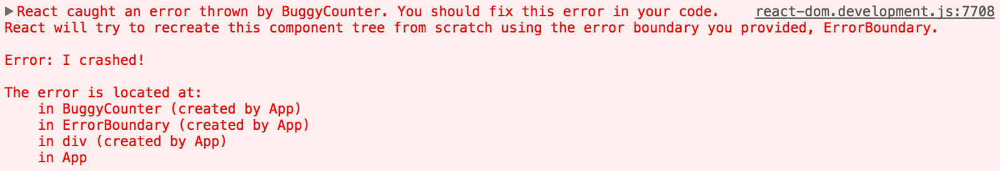
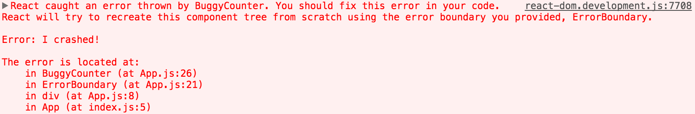

在过去，组件内部的 JavaScript 错误会破坏 React 的内部状态，并在下一次渲染时[发出](https://github.com/facebook/react/issues/4026)[隐晦的](https://github.com/facebook/react/issues/6895)[错误信息](https://github.com/facebook/react/issues/8579)。这些错误总是由于应用代码中早期的错误造成的，但 React 没有提供一种在组件内部优雅地处理它们的方式，也不能从错误中恢复。

## 错误边界介绍

部分 UI 的 JavaScript 错误不应该破坏整个应用。为了解决这个问题，React 16 引入一个叫做“错误边界”的新概念。

错误边界是用于一个 React 组件，它**捕获其子组件树中任何地方的 JavaScript 错误，记录这些错误并展示一个回退的 UI**，而不是组件树的崩溃。错误边界可以在渲染期间、生命周期方法内以及整棵树下的构造函数中捕获错误。

> 注意
> 
> 错误边界**不会**捕获如下错误：
>
> * 事件处理（[了解更多](#how-about-event-handlers)）
> * 异步代码（例如 `setTimeout` 或者 `requestAnimationFrame` 回调）
> * 服务端渲染
> * 错误边界自身抛出的异常（而不是其子组件）

如果一个类组件定义了一个新的 `componentDidCatch(error, info)` 生命周期方法，那么它就成了一个错误边界：

```js{7-12,15-18}
class ErrorBoundary extends React.Component {
  constructor(props) {
    super(props);
    this.state = { hasError: false };
  }

  componentDidCatch(error, info) {
    // Display fallback UI
    this.setState({ hasError: true });
    // You can also log the error to an error reporting service
    logErrorToMyService(error, info);
  }

  render() {
    if (this.state.hasError) {
      // You can render any custom fallback UI
      return <h1>Something went wrong.</h1>;
    }
    return this.props.children;
  }
}
```

然后你可以把它作为一个普通组件来使用：

```js
<ErrorBoundary>
  <MyWidget />
</ErrorBoundary>
```

`componentDidCatch()` 方法像 JavaScript 的 `catch {}` 一样，但它只针对组件。只有类组件可以成为错误边界。实际上，大多数时候你只需要声明一个错误边界组件，然后在整个应用中使用它。

需要注意的是**错误边界仅捕获其子组件树中的错误**。错误边界不能捕获其自身的错误。如果错误边界渲染错误信息失败，那错误会冒泡到其最近的错误边界。这也类似于 JavaScript 中 `catch {}`。

### componentDidCatch 参数

`error` 是被抛出的错误。

`info` 是一个包含 `componentStack` 键的对象。这个属性包含了抛出错误时关于组件的堆栈信息。

```js
//...
componentDidCatch(error, info) {
  
  /* 堆栈信息示例：
     in ComponentThatThrows (created by App)
     in ErrorBoundary (created by App)
     in div (created by App)
     in App
  */
  logComponentStackToMyService(info.componentStack);
}

//...
```

## 在线示例

查看这个使用  [React 16 beta](https://github.com/facebook/react/issues/10294) 来[声明和使用错误边界的示例](https://codepen.io/gaearon/pen/wqvxGa?editors=0010)。


## 何处放置错误边界

错误边界的粒度取决于你。你可以包裹顶层的路由组件来向用户展示一个“出错”信息，就像服务端框架通常处理崩溃一样。你也可以将独立插件包裹在错误边界中来保护应用不受其崩溃而影响。

## 未捕获错误的新行为

这一变化具有重要意义。**从 React 16 开始，任何没有被错误边界捕获的错误会导致整个 React 组件树的卸载。**

这个决定饱受争议，但根据我们的经验，保留错误的 UI 会比完全移除它更糟糕。例如，在像 Messenger 的产品中，保留错误的 UI 可见会导致有人向错误的人发送信息。同样地，在支付应用中展示一个错误的金额会比什么都不渲染更糟糕。

这个变化意味着，随着你迁移到 React 16，你可能会发现一些你以前在你的应用中没有注意到的崩溃。添加错误边界可以在发生错误时提供更好的用户体验。

例如，Facebook Messenger 将侧边栏、信息面板、聊天记录和信息输入框包裹在各自的错误边界中。如果这些 UI 中的某个组件崩溃了，其余部分仍然可用。

我们也鼓励你使用 JS 错误报告服务（或者自行构建）以便你可以可以发现生产环境产生的异常并修复它们。


## 组件栈追踪

React 16 prints all errors that occurred during rendering to the console in development, even if the application accidentally swallows them. In addition to the error message and the JavaScript stack, it also provides component stack traces. Now you can see where exactly in the component tree the failure has happened:



You can also see the filenames and line numbers in the component stack trace. This works by default in [Create React App](https://github.com/facebookincubator/create-react-app) projects:



If you don’t use Create React App, you can add [this plugin](https://www.npmjs.com/package/babel-plugin-transform-react-jsx-source) manually to your Babel configuration. Note that it’s intended only for development and **must be disabled in production**.

> Note
> 
> Component names displayed in the stack traces depend on the [`Function.name`](https://developer.mozilla.org/en-US/docs/Web/JavaScript/Reference/Global_Objects/Function/name) property. If you support older browsers and devices which may not yet provide this natively (e.g. IE 11), consider including a `Function.name` polyfill in your bundled application, such as [`function.name-polyfill`](https://github.com/JamesMGreene/Function.name). Alternatively, you may explicitly set the [`displayName`](/docs/react-component.html#displayname) property on all your components.


## try/catch 怎么样？

`try` / `catch` is great but it only works for imperative code:

```js
try {
  showButton();
} catch (error) {
  // ...
}
```

However, React components are declarative and specify *what* should be rendered:

```js
<Button />
```

Error boundaries preserve the declarative nature of React, and behave as you would expect. For example, even if an error occurs in a `componentDidUpdate` hook caused by a `setState` somewhere deep in the tree, it will still correctly propagate to the closest error boundary.

## How About Event Handlers?

Error boundaries **do not** catch errors inside event handlers.

React doesn't need error boundaries to recover from errors in event handlers. Unlike the render method and lifecycle hooks, the event handlers don't happen during rendering. So if they throw, React still knows what to display on the screen.

If you need to catch an error inside event handler, use the regular JavaScript `try` / `catch` statement:

```js{8-12,16-19}
class MyComponent extends React.Component {
  constructor(props) {
    super(props);
    this.state = { error: null };
  }
  
  handleClick = () => {
    try {
      // Do something that could throw
    } catch (error) {
      this.setState({ error });
    }
  }

  render() {
    if (this.state.error) {
      return <h1>Caught an error.</h1>
    }
    return <div onClick={this.handleClick}>Click Me</div>
  }
}
```

Note that the above example is demonstrating regular JavaScript behavior and doesn't use error boundaries.

## React 15 后的名称变更

React 15 included a very limited support for error boundaries under a different method name: `unstable_handleError`. This method no longer works, and you will need to change it to `componentDidCatch` in your code starting from the first 16 beta release.

For this change, we’ve provided a [codemod](https://github.com/reactjs/react-codemod#error-boundaries) to automatically migrate your code.
