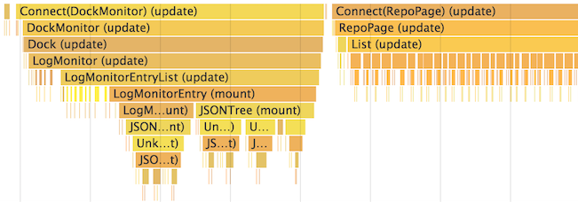

在 React 内部使用了一些巧妙的技术来最小化更新 UI 所需的昂贵的 DOM 操作。对于许多应用来说，使用 React 不需要做太多的性能优化工作就可以做到快速的用户界面。不过，这里有几种方法可以加快你的 React 应用。

## 使用生产版本

如果你在 React 应用中进行基准测试或遇到性能问题时，请确保你正在使用压缩过的生产版本。

默认情况下，React 包含了许多有用的警告。这些警告在开发环境下非常有用。然而，它们会使 React 更大更慢，所以当你部署应用时请确保使用了生产版本。

如果你不确定构建流程是否正确，可以通过安装 [Chrome 的 React 开发者工具](https://chrome.google.com/webstore/detail/react-developer-tools/fmkadmapgofadopljbjfkapdkoienihi) 来检查。如果访问生产模式的 React 应用，这个图标会有一个深色背景：


如果访问开发模式的 React 应用，这个图标会有一个红色背景：


开发应用时使用开发模式，部署应用时使用生产模式。

你可以在下面找到构建生产环境应用的指导。

### Create React App

如果你的项目是通过 [Create React App](https://github.com/facebookincubator/create-react-app) 创建的，运行：

```
npm run build
```

这会在项目的 `build/` 文件夹中创建一个生产版本的应用。

请记住，项目部署到生产环境时才这样做。对于正常的开发，使用 `npm start`。

### 单文件生产版本

我们提供了作为单个文件的 React 和 React DOM 生产环境版本。

```html
<script src="https://unpkg.com/react@16/umd/react.production.min.js"></script>
<script src="https://unpkg.com/react-dom@16/umd/react-dom.production.min.js"></script>
```

注意只有以 `.production.min.js` 结尾的 React 文件才适用于生产环境。

### Brunch

为了最高效的 Brunch 生产版本，需要安装 [`uglify-js-brunch`](https://github.com/brunch/uglify-js-brunch) 插件。

```
# 使用 npm
npm install --save-dev uglify-js-brunch

# 使用 Yarn
yarn add --dev uglify-js-brunch
```

然后，为了创建生产版本，在 `build` 命令后添加 `-p` 参数：

```
brunch build -p
```

需要注意的是只有生产版本才需要这样做。在开发时不需要传入 `-p` 参数，也不需要应用这个插件，因为那会隐藏掉 React 有用的警告并使得构建过程更慢。

### Browserify

为了最高效的 Browserify 生产版本，需要安装一些插件：

```
# 使用 npm
npm install --save-dev envify uglify-js uglifyify 

# 使用 Yarn
yarn add --dev envify uglify-js uglifyify 
```

为了创建生产版本，请确保你添加了这些转换（**顺序很重要**）。

* [`envify`](https://github.com/hughsk/envify) 转换确保设置了正确的构建环境。全局安装（`-g`）。
* [`uglifyify`](https://github.com/hughsk/uglifyify) 转换移除开发引入。也全局安装（`-g`）。
* 最后，[`uglify-js`](https://github.com/mishoo/UglifyJS2) 会将生成的包进行整合（[了解原因](https://github.com/hughsk/uglifyify#motivationusage)）。

示例：

```
browserify ./index.js \
  -g [ envify --NODE_ENV production ] \
  -g uglifyify \
  | uglifyjs --compress --mangle > ./bundle.js
```

>**注意：**
>
> 包名称是 `uglify-js`，但它提供的二进制文件叫做 `uglifyjs`。<br>
> 这不是一个笔误。

需要注意的是只有生产版本才需要这样做。在开发时不需要应用这些插件，因为那会隐藏掉 React 有用的警告并使得构建过程更慢。

### Rollup

为了最高效的 Rollup 生产版本，需要安装一些插件：

```
# 使用 npm
npm install --save-dev rollup-plugin-commonjs rollup-plugin-replace rollup-plugin-uglify 

# 使用 Yarn
yarn add --dev rollup-plugin-commonjs rollup-plugin-replace rollup-plugin-uglify 
```

为了创建生产版本，请确保你添加了这些插件（**顺序很重要**）。

* [`replace`](https://github.com/rollup/rollup-plugin-replace) 插件确保设置了正确的构建环境。
* [`commonjs`](https://github.com/rollup/rollup-plugin-commonjs) 插件提供了在 Rollup 中对 CommonJS 的支持。
* [`uglify`](https://github.com/TrySound/rollup-plugin-uglify) 插件压缩并整合最终的包。

```js
plugins: [
  // ...
  require('rollup-plugin-replace')({
    'process.env.NODE_ENV': JSON.stringify('production')
  }),
  require('rollup-plugin-commonjs')(),
  require('rollup-plugin-uglify')(),
  // ...
]
```

完整的设置示例请[查看这个 gist](https://gist.github.com/Rich-Harris/cb14f4bc0670c47d00d191565be36bf0)。

需要注意的是只有生产版本才需要这样做。在开发时不需要应用 `uglify` 插件或者在 `replace` 插件中设置 `'production'` 值，因为那会隐藏掉 React 有用的警告并使得构建过程更慢。


### webpack

> **主要：**
>
> 如果你正在使用 Create React App，请参考[上述说明](#create-react-app)。<br>
> 本节只适用于直接配置 webpack 的情况。

为了最高效的 webpack 生产版本，请确保在生产配置中包含了这些插件：

```js
new webpack.DefinePlugin({
  'process.env.NODE_ENV': JSON.stringify('production')
}),
new webpack.optimize.UglifyJsPlugin()
```

你可以在 [webpack 文档](https://webpack.js.org/guides/production-build/)中了解更多。

需要注意的是只有生产版本才需要这样做。在开发时不需要应用 `UglifyJsPlugin` 插件或者在 `DefinePlugin` 插件中设置 `'production'` 值，因为那会隐藏掉 React 有用的警告并使得构建过程更慢。

## 使用 Chrome Performance 选项卡中的 Profiling 组件

在 **开发**模式下，你可以在支持的浏览器中使用性能工具来直观地了解组件是如何挂载、更新和卸载的，例如：

<center></center>

在 Chrome 浏览器中这么做：

1. 暂时**禁用所有 Chrome 拓展程序，特别是 React 开发者工具**。它们会明显地歪曲结果。

2. 确保在应用在开发模式下运行。

3. 打开 Chrome 开发者工具的 **[Performance](https://developers.google.com/web/tools/chrome-devtools/evaluate-performance/timeline-tool)** 选项卡，然后点击 **Record**。

4. 执行你想要分析的操作。记录不要超过 20 秒，否则 Chrome 可能会挂起。

5. 停止记录。

6. React 事件会被分组显示在 **User Timing** 标签下。

更详细的操作演示请查看 [Ben Schwarz 写的这篇文章](https://building.calibreapp.com/debugging-react-performance-with-react-16-and-chrome-devtools-c90698a522ad)。

需要注意的是**这些数字是相对的，所以组件在生产环境下会渲染得更快**。不过，这应该可以帮助你了解到什么时候哪些无关的 UI 被错误地更新了，以及 UI 更新的深度和频度。

目前只有 Chrome、Edge 和 IE 支持这个功能，但我们使用的是标准的 [User Timing API](https://developer.mozilla.org/en-US/docs/Web/API/User_Timing_API)，所以我们可以期待更多的浏览器添加对这个功能的支持。

## Virtualize Long Lists

If your application renders long lists of data (hundreds or thousands of rows), we recommended using a technique known as "windowing". This technique only renders a small subset of your rows at any given time, and can dramatically reduce the time it takes to re-render the components as well as the number of DOM nodes created.

[React Virtualized](https://bvaughn.github.io/react-virtualized/) is one popular windowing library. It provides several reusable components for displaying lists, grids, and tabular data. You can also create your own windowing component, like [Twitter did](https://medium.com/@paularmstrong/twitter-lite-and-high-performance-react-progressive-web-apps-at-scale-d28a00e780a3), if you want something more tailored to your application's specific use case.

## Avoid Reconciliation

React builds and maintains an internal representation of the rendered UI. It includes the React elements you return from your components. This representation lets React avoid creating DOM nodes and accessing existing ones beyond necessity, as that can be slower than operations on JavaScript objects. Sometimes it is referred to as a "virtual DOM", but it works the same way on React Native.

When a component's props or state change, React decides whether an actual DOM update is necessary by comparing the newly returned element with the previously rendered one. When they are not equal, React will update the DOM.

You can now visualize these re-renders of the virtual DOM with React DevTools:

- [Chrome Browser Extension](https://chrome.google.com/webstore/detail/react-developer-tools/fmkadmapgofadopljbjfkapdkoienihi?hl=en)
- [Firefox Browser Extension](https://addons.mozilla.org/en-GB/firefox/addon/react-devtools/)
- [Standalone Node Package](https://www.npmjs.com/package/react-devtools)

In the developer console select the **Highlight Updates** option in the **React** tab:

<center></center>

Interact with your page and you should see colored borders momentarily appear around any components that have re-rendered. This lets you spot re-renders that were not necessary. You can learn more about this React DevTools feature from this [blog post](https://blog.logrocket.com/make-react-fast-again-part-3-highlighting-component-updates-6119e45e6833) from [Ben Edelstein](https://blog.logrocket.com/@edelstein).

Consider this example:

<center></center>

Note that when we're entering a second todo, the first todo also flashes on the screen on every keystroke. This means it is being re-rendered by React together with the input. This is sometimes called a "wasted" render. We know it is unnecessary because the first todo content has not changed, but React doesn't know this.

Even though React only updates the changed DOM nodes, re-rendering still takes some time. In many cases it's not a problem, but if the slowdown is noticeable, you can speed all of this up by overriding the lifecycle function `shouldComponentUpdate`, which is triggered before the re-rendering process starts. The default implementation of this function returns `true`, leaving React to perform the update:

```javascript
shouldComponentUpdate(nextProps, nextState) {
  return true;
}
```

If you know that in some situations your component doesn't need to update, you can return `false` from `shouldComponentUpdate` instead, to skip the whole rendering process, including calling `render()` on this component and below.

In most cases, instead of writing `shouldComponentUpdate()` by hand, you can inherit from [`React.PureComponent`](/docs/react-api.html#reactpurecomponent). It is equivalent to implementing `shouldComponentUpdate()` with a shallow comparison of current and previous props and state.

## shouldComponentUpdate In Action

Here's a subtree of components. For each one, `SCU` indicates what `shouldComponentUpdate` returned, and `vDOMEq` indicates whether the rendered React elements were equivalent. Finally, the circle's color indicates whether the component had to be reconciled or not.

<figure></figure>

Since `shouldComponentUpdate` returned `false` for the subtree rooted at C2, React did not attempt to render C2, and thus didn't even have to invoke `shouldComponentUpdate` on C4 and C5.

For C1 and C3, `shouldComponentUpdate` returned `true`, so React had to go down to the leaves and check them. For C6 `shouldComponentUpdate` returned `true`, and since the rendered elements weren't equivalent React had to update the DOM.

The last interesting case is C8. React had to render this component, but since the React elements it returned were equal to the previously rendered ones, it didn't have to update the DOM.

Note that React only had to do DOM mutations for C6, which was inevitable. For C8, it bailed out by comparing the rendered React elements, and for C2's subtree and C7, it didn't even have to compare the elements as we bailed out on `shouldComponentUpdate`, and `render` was not called.

## Examples

If the only way your component ever changes is when the `props.color` or the `state.count` variable changes, you could have `shouldComponentUpdate` check that:

```javascript
class CounterButton extends React.Component {
  constructor(props) {
    super(props);
    this.state = {count: 1};
  }

  shouldComponentUpdate(nextProps, nextState) {
    if (this.props.color !== nextProps.color) {
      return true;
    }
    if (this.state.count !== nextState.count) {
      return true;
    }
    return false;
  }

  render() {
    return (
      <button
        color={this.props.color}
        onClick={() => this.setState(state => ({count: state.count + 1}))}>
        Count: {this.state.count}
      </button>
    );
  }
}
```

In this code, `shouldComponentUpdate` is just checking if there is any change in `props.color` or `state.count`. If those values don't change, the component doesn't update. If your component got more complex, you could use a similar pattern of doing a "shallow comparison" between all the fields of `props` and `state` to determine if the component should update. This pattern is common enough that React provides a helper to use this logic - just inherit from `React.PureComponent`. So this code is a simpler way to achieve the same thing:

```js
class CounterButton extends React.PureComponent {
  constructor(props) {
    super(props);
    this.state = {count: 1};
  }

  render() {
    return (
      <button
        color={this.props.color}
        onClick={() => this.setState(state => ({count: state.count + 1}))}>
        Count: {this.state.count}
      </button>
    );
  }
}
```

Most of the time, you can use `React.PureComponent` instead of writing your own `shouldComponentUpdate`. It only does a shallow comparison, so you can't use it if the props or state may have been mutated in a way that a shallow comparison would miss.

This can be a problem with more complex data structures. For example, let's say you want a `ListOfWords` component to render a comma-separated list of words, with a parent `WordAdder` component that lets you click a button to add a word to the list. This code does *not* work correctly:

```javascript
class ListOfWords extends React.PureComponent {
  render() {
    return <div>{this.props.words.join(',')}</div>;
  }
}

class WordAdder extends React.Component {
  constructor(props) {
    super(props);
    this.state = {
      words: ['marklar']
    };
    this.handleClick = this.handleClick.bind(this);
  }

  handleClick() {
    // This section is bad style and causes a bug
    const words = this.state.words;
    words.push('marklar');
    this.setState({words: words});
  }

  render() {
    return (
      <div>
        <button onClick={this.handleClick} />
        <ListOfWords words={this.state.words} />
      </div>
    );
  }
}
```

The problem is that `PureComponent` will do a simple comparison between the old and new values of `this.props.words`. Since this code mutates the `words` array in the `handleClick` method of `WordAdder`, the old and new values of `this.props.words` will compare as equal, even though the actual words in the array have changed. The `ListOfWords` will thus not update even though it has new words that should be rendered.

## The Power Of Not Mutating Data

The simplest way to avoid this problem is to avoid mutating values that you are using as props or state. For example, the `handleClick` method above could be rewritten using `concat` as:

```javascript
handleClick() {
  this.setState(prevState => ({
    words: prevState.words.concat(['marklar'])
  }));
}
```

ES6 supports a [spread syntax](https://developer.mozilla.org/en-US/docs/Web/JavaScript/Reference/Operators/Spread_operator) for arrays which can make this easier. If you're using Create React App, this syntax is available by default.

```js
handleClick() {
  this.setState(prevState => ({
    words: [...prevState.words, 'marklar'],
  }));
};
```

You can also rewrite code that mutates objects to avoid mutation, in a similar way. For example, let's say we have an object named `colormap` and we want to write a function that changes `colormap.right` to be `'blue'`. We could write:

```js
function updateColorMap(colormap) {
  colormap.right = 'blue';
}
```

To write this without mutating the original object, we can use [Object.assign](https://developer.mozilla.org/en-US/docs/Web/JavaScript/Reference/Global_Objects/Object/assign) method:

```js
function updateColorMap(colormap) {
  return Object.assign({}, colormap, {right: 'blue'});
}
```

`updateColorMap` now returns a new object, rather than mutating the old one. `Object.assign` is in ES6 and requires a polyfill.

There is a JavaScript proposal to add [object spread properties](https://github.com/sebmarkbage/ecmascript-rest-spread) to make it easier to update objects without mutation as well:

```js
function updateColorMap(colormap) {
  return {...colormap, right: 'blue'};
}
```

If you're using Create React App, both `Object.assign` and the object spread syntax are available by default.

## Using Immutable Data Structures

[Immutable.js](https://github.com/facebook/immutable-js) is another way to solve this problem. It provides immutable, persistent collections that work via structural sharing:

* *Immutable*: once created, a collection cannot be altered at another point in time.
* *Persistent*: new collections can be created from a previous collection and a mutation such as set. The original collection is still valid after the new collection is created.
* *Structural Sharing*: new collections are created using as much of the same structure as the original collection as possible, reducing copying to a minimum to improve performance.

Immutability makes tracking changes cheap. A change will always result in a new object so we only need to check if the reference to the object has changed. For example, in this regular JavaScript code:

```javascript
const x = { foo: 'bar' };
const y = x;
y.foo = 'baz';
x === y; // true
```

Although `y` was edited, since it's a reference to the same object as `x`, this comparison returns `true`. You can write similar code with immutable.js:

```javascript
const SomeRecord = Immutable.Record({ foo: null });
const x = new SomeRecord({ foo: 'bar' });
const y = x.set('foo', 'baz');
const z = x.set('foo', 'bar');
x === y; // false
x === z; // true
```

In this case, since a new reference is returned when mutating `x`, we can use a reference equality check `(x === y)` to verify that the new value stored in `y` is different than the original value stored in `x`.

Two other libraries that can help use immutable data are [seamless-immutable](https://github.com/rtfeldman/seamless-immutable) and [immutability-helper](https://github.com/kolodny/immutability-helper).

Immutable data structures provide you with a cheap way to track changes on objects, which is all we need to implement `shouldComponentUpdate`. This can often provide you with a nice performance boost.