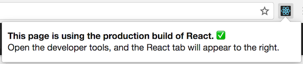

在 React 内部使用了一些巧妙的技术来最小化更新 UI 所需的昂贵的 DOM 操作。对于许多应用来说，使用 React 不需要做太多的性能优化工作就可以做到快速的用户界面。不过，这里有几种方法可以加快你的 React 应用。

## 使用生产版本

如果你在 React 应用中进行基准测试或遇到性能问题时，请确保你正在使用压缩过的生产版本。

默认情况下，React 包含了许多有用的警告。这些警告在开发环境下非常有用。然而，它们会使 React 更大更慢，所以当你部署应用时请确保使用了生产版本。

如果你不确定构建流程是否正确，可以通过安装 [Chrome 的 React 开发者工具](https://chrome.google.com/webstore/detail/react-developer-tools/fmkadmapgofadopljbjfkapdkoienihi) 来检查。如果访问生产模式的 React 应用，这个图标会有一个深色背景：



如果访问开发模式的 React 应用，这个图标会有一个红色背景：


开发应用时使用开发模式，部署应用时使用生产模式。

你可以在下面找到构建生产环境应用的指导。

### Create React App

如果你的项目是通过 [Create React App](https://github.com/facebookincubator/create-react-app) 创建的，运行：

```
npm run build
```

这会在项目的 `build/` 文件夹中创建一个生产版本的应用。

请记住，项目部署到生产环境时才这样做。对于正常的开发，使用 `npm start`。

### 单文件生产版本

我们提供了作为单个文件的 React 和 React DOM 生产环境版本。

```html
<script src="https://unpkg.com/react@16/umd/react.production.min.js"></script>
<script src="https://unpkg.com/react-dom@16/umd/react-dom.production.min.js"></script>
```

注意只有以 `.production.min.js` 结尾的 React 文件才适用于生产环境。

### Brunch

为了最高效的 Brunch 生产版本，需要安装 [`uglify-js-brunch`](https://github.com/brunch/uglify-js-brunch) 插件。

```
# 使用 npm
npm install --save-dev uglify-js-brunch

# 使用 Yarn
yarn add --dev uglify-js-brunch
```

然后，为了创建生产版本，在 `build` 命令后添加 `-p` 参数：

```
brunch build -p
```

需要注意的是只有生产版本才需要这样做。在开发时不需要传入 `-p` 参数，也不需要应用这个插件，因为那会隐藏掉 React 有用的警告并使得构建过程更慢。

### Browserify

为了最高效的 Browserify 生产版本，需要安装一些插件：

```
# 使用 npm
npm install --save-dev envify uglify-js uglifyify 

# 使用 Yarn
yarn add --dev envify uglify-js uglifyify 
```

为了创建生产版本，请确保你添加了这些转换（**顺序很重要**）。

* [`envify`](https://github.com/hughsk/envify) 转换确保设置了正确的构建环境。全局安装（`-g`）。
* [`uglifyify`](https://github.com/hughsk/uglifyify) 转换移除开发引入。也全局安装（`-g`）。
* 最后，[`uglify-js`](https://github.com/mishoo/UglifyJS2) 会将生成的包进行整合（[了解原因](https://github.com/hughsk/uglifyify#motivationusage)）。

示例：

```
browserify ./index.js \
  -g [ envify --NODE_ENV production ] \
  -g uglifyify \
  | uglifyjs --compress --mangle > ./bundle.js
```

>**注意：**
>
> 包名称是 `uglify-js`，但它提供的二进制文件叫做 `uglifyjs`。<br>
> 这不是一个笔误。

需要注意的是只有生产版本才需要这样做。在开发时不需要应用这些插件，因为那会隐藏掉 React 有用的警告并使得构建过程更慢。

### Rollup

为了最高效的 Rollup 生产版本，需要安装一些插件：

```
# 使用 npm
npm install --save-dev rollup-plugin-commonjs rollup-plugin-replace rollup-plugin-uglify 

# 使用 Yarn
yarn add --dev rollup-plugin-commonjs rollup-plugin-replace rollup-plugin-uglify 
```

为了创建生产版本，请确保你添加了这些插件（**顺序很重要**）。

* [`replace`](https://github.com/rollup/rollup-plugin-replace) 插件确保设置了正确的构建环境。
* [`commonjs`](https://github.com/rollup/rollup-plugin-commonjs) 插件提供了在 Rollup 中对 CommonJS 的支持。
* [`uglify`](https://github.com/TrySound/rollup-plugin-uglify) 插件压缩并整合最终的包。

```js
plugins: [
  // ...
  require('rollup-plugin-replace')({
    'process.env.NODE_ENV': JSON.stringify('production')
  }),
  require('rollup-plugin-commonjs')(),
  require('rollup-plugin-uglify')(),
  // ...
]
```

完整的设置示例请[查看这个 gist](https://gist.github.com/Rich-Harris/cb14f4bc0670c47d00d191565be36bf0)。

需要注意的是只有生产版本才需要这样做。在开发时不需要应用 `uglify` 插件或者在 `replace` 插件中设置 `'production'` 值，因为那会隐藏掉 React 有用的警告并使得构建过程更慢。


### webpack

> **主要：**
>
> 如果你正在使用 Create React App，请参考[上述说明](#create-react-app)。<br>
> 本节只适用于直接配置 webpack 的情况。

为了最高效的 webpack 生产版本，请确保在生产配置中包含了这些插件：

```js
new webpack.DefinePlugin({
  'process.env.NODE_ENV': JSON.stringify('production')
}),
new webpack.optimize.UglifyJsPlugin()
```

你可以在 [webpack 文档](https://webpack.js.org/guides/production-build/)中了解更多。

需要注意的是只有生产版本才需要这样做。在开发时不需要应用 `UglifyJsPlugin` 插件或者在 `DefinePlugin` 插件中设置 `'production'` 值，因为那会隐藏掉 React 有用的警告并使得构建过程更慢。

## 使用 Chrome Performance 选项卡中的 Profiling 组件

在 **开发**模式下，你可以在支持的浏览器中使用性能工具来直观地了解组件是如何挂载、更新和卸载的，例如：

<center></center>

在 Chrome 浏览器中这么做：

1. 暂时**禁用所有 Chrome 拓展程序，特别是 React 开发者工具**。它们会明显地歪曲结果。

2. 确保在应用在开发模式下运行。

3. 打开 Chrome 开发者工具的 **[Performance](https://developers.google.com/web/tools/chrome-devtools/evaluate-performance/timeline-tool)** 选项卡，然后点击 **Record**。

4. 执行你想要分析的操作。记录不要超过 20 秒，否则 Chrome 可能会挂起。

5. 停止记录。

6. React 事件会被分组显示在 **User Timing** 标签下。

更详细的操作演示请查看 [Ben Schwarz 写的这篇文章](https://building.calibreapp.com/debugging-react-performance-with-react-16-and-chrome-devtools-c90698a522ad)。

需要注意的是**这些数字是相对的，所以组件在生产环境下会渲染得更快**。不过，这应该可以帮助你了解到什么时候哪些无关的 UI 被错误地更新了，以及 UI 更新的深度和频度。

目前只有 Chrome、Edge 和 IE 支持这个功能，但我们使用的是标准的 [User Timing API](https://developer.mozilla.org/en-US/docs/Web/API/User_Timing_API)，所以我们可以期待更多的浏览器添加对这个功能的支持。

## 虚拟化长列表

如果你的应用渲染大量数据（数百或数千行），我们建议使用称为“窗口”的技术。这种技术只在任何给定时间里渲染一小部分数据，并且可以明显减少组件重新渲染的时间以及 DOM 节点创建的数量。

[React Virtualized](https://bvaughn.github.io/react-virtualized/) 是一个流行的窗口库。它提供了多个可复用的列表、网格和表格数据组件。你也可以创建自己的窗口组件，如果你想要更适合应用特定用例的东西，你可以像 [Twitter 这样做](https://medium.com/@paularmstrong/twitter-lite-and-high-performance-react-progressive-web-apps-at-scale-d28a00e780a3)。

## 避免重新渲染

React 创建并维护一份所渲染 UI 的内部实现。它包含从组件返回的 React 元素。这个实现让 React 避免了不必要的 DOM 节点创建和现有节点的访问，因为这可能比JavaScript 对象操作更慢。有时它被称为“虚拟 DOM”，但它在 React Native 上的工作方式是相同的。

当组件的 props 或 state 发生变化时，React 通过比较新返回的元素和先前渲染的元素来决定是否需要更新实际的 DOM。当它们不相等时，React 会更新 DOM。

现在你可以使用 React 开发者工具来可视化这些重新渲染的虚拟 DOM：

- [Chrome 浏览器拓展程序](https://chrome.google.com/webstore/detail/react-developer-tools/fmkadmapgofadopljbjfkapdkoienihi?hl=en)
- [Firefox 浏览器拓展程序](https://addons.mozilla.org/en-GB/firefox/addon/react-devtools/)
- [独立的 Node 包](https://www.npmjs.com/package/react-devtools)

在开发人员控制台中，选择 **React** 选项卡中的 **Highlight Updates** 选项：

<center></center>

与页面进行交互，你应该会看到任何重新渲染的组件的周围都会出现彩色边框。这可以让你发现没有必要的重新渲染。你可以从 [Ben Edelstein](https://blog.logrocket.com/@edelstein) 的[博客文章](https://blog.logrocket.com/make-react-fast-again-part-3-highlighting-component-updates-6119e45e6833)了解更多有关 React 开发者工具功能的信息。

考虑下这个示例：

<center></center>

请注意，当我们进入第二个待办事项时，每次按键第一个待办事项也会在屏幕上闪烁。这意味着它正在被 React 和输入一起重新渲染。这有时被称为“浪费”的渲染。我们知道这是没有必要的，因为第一个待办事项的内容没有改变，但 React 并不知道。

即使 React 只更新变化的 DOM 节点，但重新渲染仍然需要一些时间。在许多情况下，这不是问题，但是如果有很明显的缓慢，那可以通过重写生命周期函数 `shouldComponentUpdate` 来加速，它是在重新渲染过程开始之前触发的，默认实现是返回 `true` 来让 React 执行更新：

```javascript
shouldComponentUpdate(nextProps, nextState) {
  return true;
}
```

如果你知道在某些情况下你的组件不需要更新，你可以在 `shouldComponentUpdate` 中返回 `false` 来跳过整个渲染过程，包括在这个组件的 `render()` 调用和其子组件。

在大多数情况下，可以不用手写 `shouldComponentUpdate()`，而是继承 [`React.PureComponent`](/docs/react-api.html#reactpurecomponent)。这相当于通过浅对比当前和之前的 props 和 state 来实现`shouldComponentUpdate()`。

## 使用 shouldComponentUpdate

下面一个组件的子树。对于其子组件，每个 `SCU` 表示 `shouldComponentUpdate` 返回的内容，`vDOMEq` 表示渲染的 React 元素是否一致。最后，圆圈的颜色表示组件是否需要重新渲染。

<figure></figure>

由于以 C2 为根的子树的 `shouldComponentUpdate` 返回 `false`，所以 React 不会试图去渲染 C2，甚至不需要在 C4 和 C5 里调用 `shouldComponentUpdate`。

对于 C1 和 C3 来说，`shouldComponentUpdate` 返回 `true`，所以 React 会深入到子树中，并检查它们。C6 的 `shouldComponentUpdate` 返回 `true`，由于渲染的元素不一致，React 会更新 DOM。

最后一个有趣的是 C8，React 需要渲染这个组件，但是由于它返回的 React 元素和之前渲染的一致，所以不需要更新 DOM。

需要注意的是 React 只需要更新 C6，因为这是不可避免的。对于 C8 来说，通过比较渲染的 React 元素没有进行更新，对于 C2 的子树和 C7 来说，甚至都不需要进行比较，因为我们在 `shouldComponentUpdate` 上就阻止了更新，`render` 没有被调用。

## 示例

如果组件改变的唯一方式是当 `props.color` 或 `state.count` 变量发生变化时，那你可以通过 `shouldComponentUpdate` 来检查：

```javascript
class CounterButton extends React.Component {
  constructor(props) {
    super(props);
    this.state = {count: 1};
  }

  shouldComponentUpdate(nextProps, nextState) {
    if (this.props.color !== nextProps.color) {
      return true;
    }
    if (this.state.count !== nextState.count) {
      return true;
    }
    return false;
  }

  render() {
    return (
      <button
        color={this.props.color}
        onClick={() => this.setState(state => ({count: state.count + 1}))}>
        Count: {this.state.count}
      </button>
    );
  }
}
```

在这份代码中，`shouldComponentUpdate` 只检查 `props.color` 或者 `state.count` 是否有变化。如果这些值没有变，组件不会更新。如果你的组件变得更复杂，你可以使用“浅对比” `props` 和 `state` 的模式来决定组件是否需要更新。这种模式很常见，所以 React 提供了一个辅助类来使用这个逻辑 —— 只需要继承 `React.PureComponent`。下面的代码是更简单的实现来达到同样的效果：

```js
class CounterButton extends React.PureComponent {
  constructor(props) {
    super(props);
    this.state = {count: 1};
  }

  render() {
    return (
      <button
        color={this.props.color}
        onClick={() => this.setState(state => ({count: state.count + 1}))}>
        Count: {this.state.count}
      </button>
    );
  }
}
```

大多数情况，你可以使用 `React.PureComponent` 而不用编写你自己的 `shouldComponentUpdate`。这只做了一个浅对比，所以如果 props 或者 state 会以某种方式突变，那你不能这么使用，因为浅对比会忽略这些突变。

对于更复杂的数据结构这可能会是一个问题。例如，加入你想要一个 `ListOfWords` 组件来渲染一个逗号分隔的单词列表，并有一个 `WordAdder` 父组件来点击按钮添加单词。下面的代码**不会**正确工作：

```javascript
class ListOfWords extends React.PureComponent {
  render() {
    return <div>{this.props.words.join(',')}</div>;
  }
}

class WordAdder extends React.Component {
  constructor(props) {
    super(props);
    this.state = {
      words: ['marklar']
    };
    this.handleClick = this.handleClick.bind(this);
  }

  handleClick() {
    // 这部分的代码很糟糕，并且有 bug
    const words = this.state.words;
    words.push('marklar');
    this.setState({words: words});
  }

  render() {
    return (
      <div>
        <button onClick={this.handleClick} />
        <ListOfWords words={this.state.words} />
      </div>
    );
  }
}
```

问题是 `PureComponent` 只会在 `this.props.words` 的新旧值之间做一个简单的比较。由于代码中 `WordAdder` 的 `handleClick` 方法会改变 `words` 数组，尽管数组中实际的单词已经改变了，但 `this.props.words` 的新旧值也会相等。因此，即便 `ListOfWords` 有需要被更新的新单词，它也不会更新。

## 不变数据的力量

避免这个问题最简单的方式是避免可变值作为 props 或者 state 来使用。例如，上面的 `handleClick` 方法可以使用 `concat` 来重写：

```javascript
handleClick() {
  this.setState(prevState => ({
    words: prevState.words.concat(['marklar'])
  }));
}
```

ES6 支持的数组[拓展语法](https://developer.mozilla.org/en-US/docs/Web/JavaScript/Reference/Operators/Spread_operator)可以简单实现。如果你正在使用 Create React App，那这个语法是默认可用的。

```js
handleClick() {
  this.setState(prevState => ({
    words: [...prevState.words, 'marklar'],
  }));
};
```

你也可以用类似的方式重写来避免可变对象的变化。例如，假设你有一个叫做 `colormap` 的对象，我们想写一个函数来让 `colormap.right` 变成 `'blue'`。我们可以这样写：

```js
function updateColorMap(colormap) {
  colormap.right = 'blue';
}
```

为了不改变原始对象，我们可以使用 [Object.assign](https://developer.mozilla.org/en-US/docs/Web/JavaScript/Reference/Global_Objects/Object/assign) 方法：

```js
function updateColorMap(colormap) {
  return Object.assign({}, colormap, {right: 'blue'});
}
```

`updateColorMap` 现在返回了一个新的对象，而不是改变原始对象。`Object.assign` 是 ES6 语法，需要 polyfill。

还有一种更简单的更新对象，而不改变原始对象的方法就是使用[对象拓展属性](https://github.com/sebmarkbage/ecmascript-rest-spread)，它是一个 JavaScript 提议：

```js
function updateColorMap(colormap) {
  return {...colormap, right: 'blue'};
}
```

如果你正在使用 Create React App，`Object.assign` 和对象拓展语法都是默认可用的。

## 使用不可变的数据结构

[Immutable.js](https://github.com/facebook/immutable-js) 是解决这个问题的另一种方式。它通过结构共享来提供不可变的，持久的集合：

* **不可变**: 一旦创建，集合就不能在另一个时间点改变。
* **持久化**: 可以根据之前的集合以及突变来创建新的集合，例如 set。原始集合在新的集合被创建后仍然有效。
* **结构共享**: 尽可能多的使用原始集合的结构来创建新集合，将复制降到最小来提高性能。

不可变使得变化追踪很简单。每个变化始终会产生一个新的对象，所以我们只需要检查对象的引用是否改变。例如，在下面的代码中：

```javascript
const x = { foo: 'bar' };
const y = x;
y.foo = 'baz';
x === y; // true
```

尽管 `y` 被修改了，由于它和 `x` 都是同一个对象的引用，这个比较返回 `true`。你可以用 immutable.js 编写同样的代码：

```javascript
const SomeRecord = Immutable.Record({ foo: null });
const x = new SomeRecord({ foo: 'bar' });
const y = x.set('foo', 'baz');
const z = x.set('foo', 'bar');
x === y; // false
x === z; // true
```

在这个例子中，由于在改变 `x` 时返回了一个新的引用，所以我们可以使用一个引用相等性检查 `(x === y)` 来验证存储在 `y` 中的新值与存储在 `x` 中的原始值是不同的。

另外两个库可以帮助我们使用不可变数据是 [seamless-immutable](https://github.com/rtfeldman/seamless-immutable) 和 [immutability-helper](https://github.com/kolodny/immutability-helper)。

不可变数据结构提供了简单的方式来追踪对象变化，这是我们实现 `shouldComponentUpdate` 所需要的。这通常可以为你提供不错的性能提升。