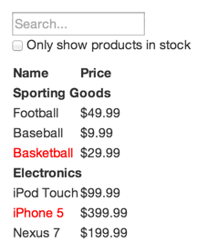

在我们看来，React 是通过 JavaScript 构建大型高性能 Web 应用的首选。它在我们的 Facebook 和 Instagram 上表现得很好。

React 的重要组成部分之一就是让你思考如何构建应用。在本文中，我们将介绍使用 React 构建可搜索的产品数据表格的思考过程。

## 从原型开始

想象我们已有一个 JSON API 和一个设计师设计的原型。原型是这样的：



JSON API 返回的数据是这样的：

```
[
  {category: "Sporting Goods", price: "$49.99", stocked: true, name: "Football"},
  {category: "Sporting Goods", price: "$9.99", stocked: true, name: "Baseball"},
  {category: "Sporting Goods", price: "$29.99", stocked: false, name: "Basketball"},
  {category: "Electronics", price: "$99.99", stocked: true, name: "iPod Touch"},
  {category: "Electronics", price: "$399.99", stocked: false, name: "iPhone 5"},
  {category: "Electronics", price: "$199.99", stocked: true, name: "Nexus 7"}
];
```

## 步骤 1：将 UI 拆解为组件结构

你要做的第一件事就是在原型中的每个组件（和子组件）周围画框并命名。如果你正在与设计师一起工作，他们可能已经完成了这项工作，和他们谈谈！他们的 Photoshop 图层名称可能最终会成为你的 React 组件的名称！

但你怎么知道自己的组件应该是什么呢？只需使用决定是否应该创建新的函数或对象一样的技巧。其中一种技术是[单一责任原则](https://en.wikipedia.org/wiki/Single_responsibility_principle)，也就是说，一个组件理想情况下只应该做一件事。如果它最终增长，那么它应该被分解成更小的子组件。

由于你经常向用户展示 JSON 数据模型，你会发现，如果你的模型构建正确，那么 UI（以及组件结构）将会很好地映射。这是因为 UI 和数据模型都倾向于遵循相同的**信息架构**，这意味着将 UI 分解为组件通常比较琐碎。只需将其分解为与某部分数据模型对应的组件。


在这里你会看到，在这个简单的应用中我们有五个组件。我们将每个组件所代表的数据用粗斜体表示。

  1. **`FilterableProductTable`（橙色）：** 包含整个示例
  2. **`SearchBar`（蓝色）：** 接收所有的**用户输入**
  3. **`ProductTable`（绿色）：** 根据**用户输入**展示和过滤**数据集**
  4. **`ProductCategoryRow`（宝石绿）：** 展示每个**类别**的标题
  5. **`ProductRow`（红色）：** 展示每条**产品**

如果你观察 `ProductTable`，你会看到表头（包含“名称”和“价格”标签）不是它自己的组件。这个是个人偏好的问题，有受争论的其他方法。对于这个例子，我们将它作为 `ProductTable` 的一部分，因为它是*产品集合*渲染的一部分，这是 `ProductTable` 的责任。但如果这个头部变得复杂（比如为分类添加排序功能），那独立一个 `ProductTableHeader` 组件会更好。

现在我们已经确定了原型中的组件，让我们将它们排列到一个层次结构中。这很容易。在原型中，出现在另一个组件内部的组件应该作为子组件出现在层次结构中：

  * `FilterableProductTable`
    * `SearchBar`
    * `ProductTable`
      * `ProductCategoryRow`
      * `ProductRow`

## Step 2: 在 React 中构建一个静态版本

<p data-height="600" data-theme-id="0" data-slug-hash="BwWzwm" data-default-tab="js" data-user="lacker" data-embed-version="2" class="codepen">See the Pen <a href="https://codepen.io/gaearon/pen/BwWzwm">Thinking In React: Step 2</a> on <a href="http://codepen.io">CodePen</a>.</p>
<script async src="https://production-assets.codepen.io/assets/embed/ei.js"></script>

现在你已经拥有了组件的层次结构，是时候实施你的应用了。最简单的方法是构建一个接收数据模型并渲染 UI 但不具有交互的版本。最好解耦这些过程，因为构建一个静态版本需要大量的代码和少量思考，而添加交互需要大量的思考，而不是大量的代码。我们会看到这是为什么。

要构建渲染数据模型的静态版本应用，你需要构建可以重用其他组件，并使用 **props** 传递数据的组件。**props** 是一种将数据从父组件传递给子组件的方式。如果你熟悉 **state** 的概念，**请不要使用 state** 来构建这个静态版本。状态仅用于交互，即数据随时会改变。由于这是静态版本的应用，所以你不需要它。

您可以自上而下或者自下而上进行构建。也就是说，你可以从层次结构中较高的组件（即从 `FilterableProductTable` 开始）或者较低的组件（`ProductRow`）开始构建。在更简单的例子中，自上而下通常会更容易，而在大型项目中，自下而上和在构建时编写测试会更容易。

在这一步结束时，你会拥有一个渲染数据模型的可重用组件库。这些组件只有 `render()` 方法，因为这是一个静态版本。层次结构顶部的组件（`FilterableProductTable`）会把你的数据模型作为一个 prop。如果对底层数据模型进行更改，并再次调用 `ReactDOM.render()`，那UI 将会更新。这有利于观察 UI 是如何更新的以及在哪里进行更改，因为这里没有任何复杂的事情发生。React 的**单向数据流**（也称为**单向绑定**）使得所有内容模块化和高性能。

如果执行此步骤需要帮助，请参阅 [React文档](/docs/)。

### 小插曲：Props 和 State

在 React 中有两种类型的数据“模型”：props 和 state。理解它们之间的差别很重要，如果你不确定它们之间的区别，可以看下 [React 官方文档](/docs/interactivity-and-dynamic-uis.html)

## 步骤 3：确定最小（但完整）的 UI State

为了使 UI 可交互，你需要能够触发对底层数据模型的更改。React 通过 **state** 让这变得很简单。

要正确构建应用，首先需要考虑应用所需要的最小可变 state 集。这里的关键是[DRY: *Don't Repeat Yourself*](https://en.wikipedia.org/wiki/Don%27t_repeat_yourself)。找出应用程序所需要的 state 的绝对最小表示形式，并计算其他所有需要的内容。 例如，如果您正在创建一个 TODO 列表，只保留一组 TODO 数组即可，不要为数量保留一个单独的 state 变量。相反，当渲染 TODO 数量时，只需简单计算 TODO 数组的长度。

观察下示例应用中的所有数据，我们有：

  * 原始产品列表
  * 用户输入的搜索文本
  * 复选框的值
  * 过滤后的产品列表

让我们一个一个来看，并确定哪一个是 state。只需对每个数据的问三个问题：

  1. 它是否通过 props 从父组件传入？如果是这样，那它可能不是 state。
  2. 它是否会一直保持不变？如果是这样，那它可能不是 state。
  3. 它是否可以根据组件中其他的 state 或者 props 计算出来？如果是这样，那它不是 state。

原始产品列表是作为 props 传入的，所以它不是 state。由于搜索文本和复选框会发生变化，并且不能从其他内容计算得出，所以它们似乎 state。最后，由于过滤后的产品列表可以通过搜索文本和复选框的值从原始产品列表中计算得出，所以它不是 state。

所以，最终我们的 state 是：

  * 用户输入的搜索文本
  * 复选框的值

## Step 4: Identify Where Your State Should Live

<p data-height="600" data-theme-id="0" data-slug-hash="qPrNQZ" data-default-tab="js" data-user="lacker" data-embed-version="2" class="codepen">See the Pen <a href="https://codepen.io/gaearon/pen/qPrNQZ">Thinking In React: Step 4</a> on <a href="http://codepen.io">CodePen</a>.</p>

好的，我们已经确定了应用最小的 state。接下来我们需要确定哪个组件可变或者**拥有**这个 state。

请记住：React 是关于组件层次结构下的单项数据流。什么组件拥有什么 state 可能不会立即清楚。**这也是新手最难理解的一部分**，所以请按照下面的步骤来弄明白：

对于应用中的每一个状态：

  * 确定每个根据这个 state 渲染某些内容的组件。
  * 找到一个公共的所有者组件（一个在层级上高于所有需要这个 state 的组件的独立组件）。
  * 这个公共的所有者组件或者层级中较高级别的其他组件应拥有该 state。
  * 如果你无法找到一个组件使得拥有这个 state 有意义，那你只需创建一个新的组件，仅用于保存状态并将其添加到层次结构中公共所有者组件上方的某个位置。

在我们的应用中也使用这个策略：

  * `ProductTable` 需要根据 state 过滤产品列表，并且 `SearchBar` 需要展示搜索文本和复选框的状态。
  * 公共的所有者组件是 `FilterableProductTable`。
  * 过滤文本和复选框的值放在 `FilterableProductTable` 是合理的。

所以我们觉得把 state 放在 `FilterableProductTable` 中。首先，在 `FilterableProductTable` 的 `constructor` 里添加一个实例属性 `this.state = {filterText: '', inStockOnly: false}` 来表示应用的初始 state。然后，将 `filterText` 和 `inStockOnly` 作为 prop 传递给 `ProductTable` 和 `SearchBar`。最后，使用这些 props 来过滤 `ProductTable` 中的数据，并且在 `SearchBar` 中设置表单域的值。

现在你可以看到你的应用会如何表现：设置 `filterText` 的值为 `"ball"` 并刷新你的应用。你会看到数据表格正确更新了。

## 步骤 5：添加反向数据流

<p data-height="600" data-theme-id="0" data-slug-hash="LzWZvb" data-default-tab="js,result" data-user="rohan10" data-embed-version="2" data-pen-title="Thinking In React: Step 5" class="codepen">See the Pen <a href="https://codepen.io/gaearon/pen/LzWZvb">Thinking In React: Step 5</a> on <a href="http://codepen.io">CodePen</a>.</p>

目前为止，我们已经构建了一个正确渲染的应用，其数据在层次结构中自上而下流动。现在是时候支持其他的数据流方式了：层次结构中的底层的表达组件需要更新 `FilterableProductTable` 中的 state。

React 使这个数据流清晰易懂，来让你理解你的程序是如何工作的，但是相比传统的双向数据绑定，它确实需要更多的代码。

如果你尝试在当前版本的示例中键入或者勾选复选框，你会发现 React 忽略了你的输入。这是故意的，因为我们已经将 `input` 的 `value` 属性设置为始终等于从 `FilterableProductTable` 传入的 `state`。

让我们思考下我们想要怎么样。我们想确保用户无论何时改变表单，我们都会更新 state 来反应用户输入。由于组件只会更新其自身的 state，`FilterableProductTable` 会传递一个只要 state 更新就会触发的回调给 `SearchBar`。我们可以使用输入上的 `onChange` 事件来通知它。 由 `FilterableProductTable` 传递的回调会调用 `setState()`，并且应用会被更新。

虽然这听起来很复杂，但实际上只有几行代码。而且这可以明确应用中的数据是如何流动的。

## And That's It

Hopefully, this gives you an idea of how to think about building components and applications with React. While it may be a little more typing than you're used to, remember that code is read far more than it's written, and it's extremely easy to read this modular, explicit code. As you start to build large libraries of components, you'll appreciate this explicitness and modularity, and with code reuse, your lines of code will start to shrink. :)
